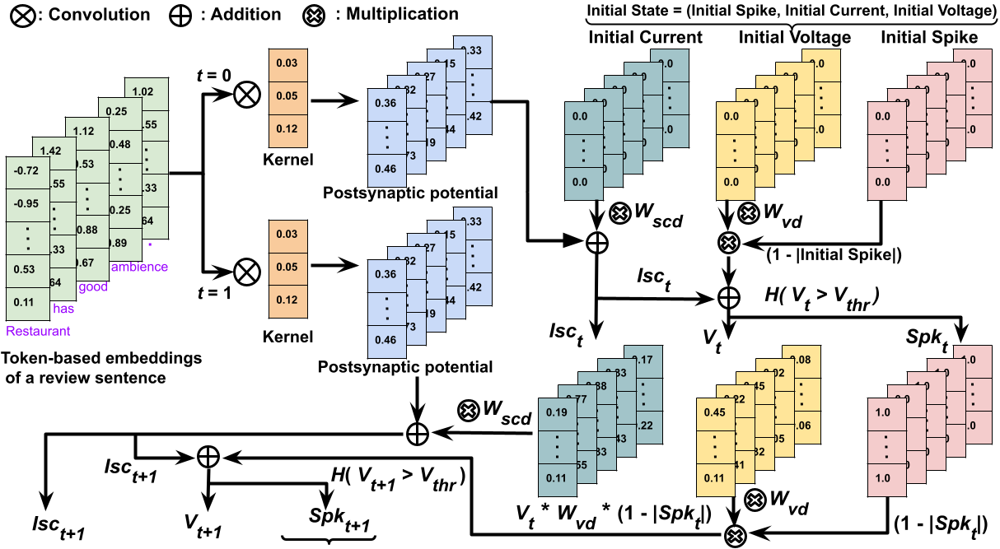

# SpikeATE
# ICDM2025: Efficient Aspect Term Extraction using Spiking Neural Network

## Envrionment

* Python 3.10.12
* Numpy 1.26.4
* Spacy 3.7.5
* Fasttext 0.9.3
* Torch 2.4.1+cu121
* GPU : Tesla T4


### Steps to run code

1. To download SemEval-2014, 2015, and 2016 datasets, click here, [SemEval-2014][1], [SemEval-2015][2], [SemEval-2016][3]
2. To download [Yelp review][4] and [Amazon Cell phones and accessories][5] datasets. 
3. To download the [glove][6] and [fasttext][7] embeddings.
4. Then, use DataProcessing.ipynb file to preprocess the datasets. 

```
train_data_path = '/SemEval/SemEval14/Laptops_Train.xml'
test_data_path = '/SemEval/SemEval14/Laptops_Test_Data_phaseB.xml'
python main.py --trainDataPath {train_data_path} --testDataPath {test_data_path} --batchSize 8 --seedNum 43 --epoch 22 --resetMechanism "zero" --spkNature "ternary" --numTimeSteps 6 --seqLen 80
```
```
train_data_path = '/SemEval/SemEval14/Restaurants_Train.xml'
test_data_path = '/SemEval/SemEval14/Restaurants_Test_Data_phaseB.xml'
python main.py --trainDataPath {train_data_path} --testDataPath {test_data_path} --batchSize 8 --seedNum 43 --epoch 20 --resetMechanism "zero" --spkNature "ternary" --numTimeSteps 6 --seqLen 82
```
```
train_data_path = '/SemEval/SemEval15/ABSA-15_Restaurants_Train_Final.xml'
test_data_path = '/SemEval/SemEval15/ABSA15_Restaurants_Test.xml'
python main.py --trainDataPath {train_data_path} --testDataPath {test_data_path} --batchSize 8 --seedNum 43 --epoch 18 --resetMechanism "zero" --spkNature "ternary" --numTimeSteps 6 --seqLen 76
```
```
train_data_path = '/SemEval/SemEval16/ABSA16_Restaurants_Train_SB1_v2.xml'
test_data_path = '/SemEval/SemEval16/EN_REST_SB1_TEST.xml.gold'
python main.py --trainDataPath {train_data_path} --testDataPath {test_data_path} --batchSize 8 --seedNum 43 --epoch 22 --resetMechanism "zero" --spkNature "ternary" --numTimeSteps 6 --seqLen 78
```

Convolutional spike encoding operation for the first two time steps.



[1]: https://alt.qcri.org/semeval2014/task4/
[2]: https://alt.qcri.org/semeval2015/task12/
[3]: https://alt.qcri.org/semeval2016/task5/
[4]: https://www.yelp.com/dataset
[5]: https://cseweb.ucsd.edu/~jmcauley/datasets.html#amazon_reviews
[6]: https://nlp.stanford.edu/projects/glove/
[7]: https://dl.fbaipublicfiles.com/fasttext/vectors-crawl/cc.en.300.bin.gz
